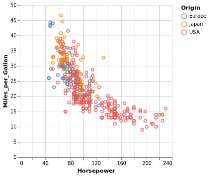

# Deneb.jl

**Deneb** is the brightest star in the constellation of the *Cygnus*, and together with **Vega** and **Altair** they form the *Summer Triangle* asterism. 

**Deneb.jl** is a convenient Julia API for creating [Vega-Lite](https://github.com/vega/vega-lite) visualizations.

## Quickstart

```julia
using Deneb
cars = "https://vega.github.io/vega-datasets/data/cars.json"
Data(url=cars) * Mark(:point) * Encoding(
    "Horsepower:q",
    "Miles_per_Gallon:q",
    color=:Origin
)
```

